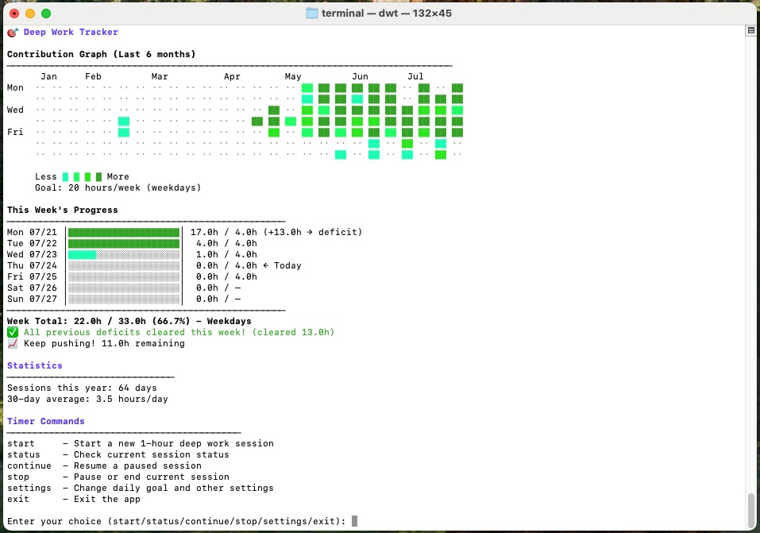

# 🎯 Deep Work Tracker

A GitHub-like terminal visualization and timer for tracking your deep work sessions.




## Prerequisites

- **macOS 12+** with Shortcuts app
- Get the following shortcuts.
	- ["start deep"](https://www.icloud.com/shortcuts/3873778e46e449b8884ffb8f475b690c): activates the 'Work' concentration mode and hides the dock
	- ["stop deep"](https://www.icloud.com/shortcuts/9d9251e825444d759da1b32b849e405e): deactivates the 'Work' concentration mode and makes the dock visible again
	

## Installation

1. **Clone or Download the Repository**
   - Download this project folder to your computer, or clone it using:
     ```bash
     git clone <repo-url>
     cd terminal
     ```

2. **Install Python (if not already installed)**
   - Requires **Python 3.8+**. Check your version with:
     ```bash
     python3 --version
     ```
   - If you need to install Python, visit [python.org/downloads](https://www.python.org/downloads/).

3. **Install Required Python Packages**
   - Install dependencies using pip:
     ```bash
     pip3 install --user rich
     ```
   - (Optional) If you want audio notifications, also install:
     ```bash
     pip3 install --user playsound
     ```

4. **Make the Tracker Globally Available**
   - Run the provided setup script to make the `dwt` command available globally:
     ```bash
	 chmod 777 install_dwt.sh
     ```
	 ```bash
     ./install_dwt.sh
     ```
   - This will create a symlink in `~/.local/bin` and ensure it is in your PATH.

5. **Run the Tracker**
   - Start the tracker with:
     ```bash
     dwt
     ```
    First time you use it you're gonna be prompted with a message saying something like "This shorcut cannot be run because this action is a scripting action and your Shorcuts security settings don't allow you to run scripting actions.

    That's ok! You just have to Open Preferences and mark the checkbox "Allow Running Scripts". Also, when you run it again open Settings -> Privacy and Security -> Accesibility and activate the Terminal checkbox

You're ready to go!

## Usage

### Main Command

```bash
dwt  # Shows progress graph, weekly stats, and opens the interactive timer menu
```

### Interactive Timer Menu

After showing your progress, you'll see:

```
Enter your choice (start/status/continue/stop/settings/exit):
```

- **start**: Start a new 1-hour deep work session
- **status**: Show current session status
- **continue**: Resume a paused session
- **stop**: Pause or end the current session
- **settings**: Change your daily goal
- **exit**: Exit the app

If you try to continue or stop with no active session, you'll see an error and the menu will reappear.

### During a Session

When a session is running, you'll see a countdown timer:

```
⏱️  59:42 │██████████████████████████████░│ [s]top [q]uit: 
```

- **Press `s`** to stop and choose to pause or end the session
- **Press `q`** to quit without logging the session
- **Press Ctrl+C** to pause immediately

### Settings

- Use the **settings** menu to change your daily goal

### Data Source

- All session data is stored in `deep-work-data.json`
- Timer state is stored in `~/.dwt_session_state.json`
